**March 19, 2024**

------
## Mälarpiraternas Trädgård

The garden of the Pirates of Mälaren, "Mälarpiraternas Trädgård", is located by a popular strolling street in Kungsholmen Stockholm. Many curious visitors with questions and wishes to join. The answers to these questions can be found on this page. A QR code is placed in the garden to assist in finding the page.

This is my PP1 project: A HTML/CSS frontend web application project, based on user experience design, accessibility and responsiveness.

------
## Visitor’s goal:

The primary aim of this website is to address common questions from curious passersby who wish to know more about the garden and perhaps even join. Visitors can find information on:

- History Fun-facts 
- Who is the garden for
- How can you join
  
------
## Site Objectives

Our site aims to:
- Serve as an informative platform about Mälarpiraternas Trädgård
- Inspire urban gardening and foster connections with the garden's community
- Adhere to accessibility standards through features like contrast and easy navigation
- Reflect a pirate theme in the logo and a green gardening ambiance in the font, colors, and shapes
- Ensure ease of exploration and navigation for users

------
## Design

### Colors
The website's color palette intend to harmonize with the site's natural theme and floral imagery. The dark green is employed in the background to provide a solid foundation to complement the vibrant flower photos. Additionally, the use of black and white ensures strong contrast and enhances the readability of the primary content and naviation. Finally, a touch of pink has been reserved for call-to-action and signup button for added emphasis.

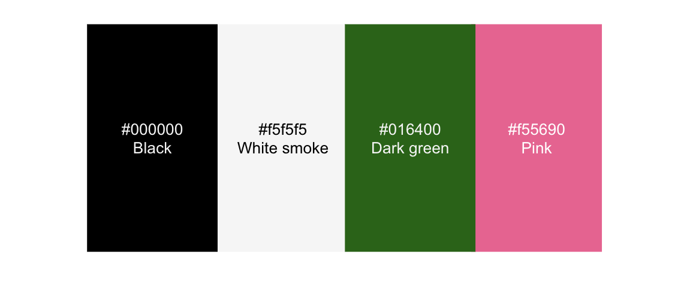

### Fonts

- The google font, Protest Revolution, is used in the h1 logo, to give a hand written text style to match the pirate theme. 
- Merriweater is used for body text and headers to match the organic content

### Web Structure & Wireframes

The website consists of three main pages:
1. Home
2. Gallery
3. Contact

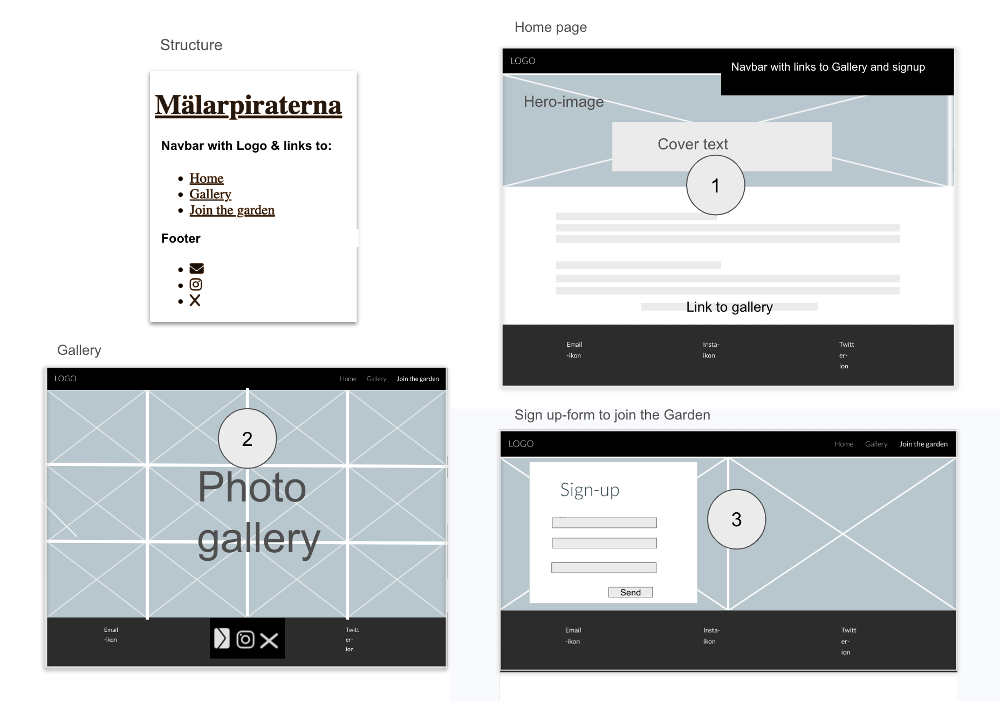
------
# Features

## Head
- Includes essential elements for Google searchability like Title, Meta description, and Meta keywords

## Header & Footer
Responsive Header and Footer is the first and last section and are visible on each page. All content and services should always be near and clear to make it quick and easy for the user to find and reach what they are looking for. Header and Footer in black and white for optimal contrast and readability. The colors also create consistency and clear separation from the main content and creates a clear line to the surrounding navigation

Header 
- Logo designed to match the pirate theme of the garden, placed to the left 
- Navbar with links to Home, Gallery and Join the Garden, placed to the right
- Active Link is underlined to clearly show the user which page they are on

Image of header with responsive navbar:

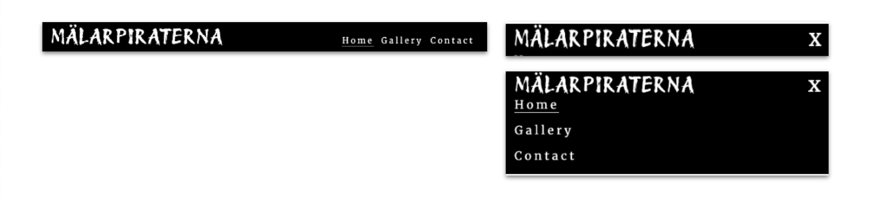

Footer
Email in the footer is valuable to the user as it gives them easy access to our email-contact and external social media, throughout the site to make it easy to connect with Mälarpiraterna in our external cannels

- Evenly spread out in the footer are inks to our external communication channels; instagram, X (Twitter) and e-mail 
- The links will open to a new tab to allow easy navigation for the user

Image of footer with email and social media links:

------
## The home page

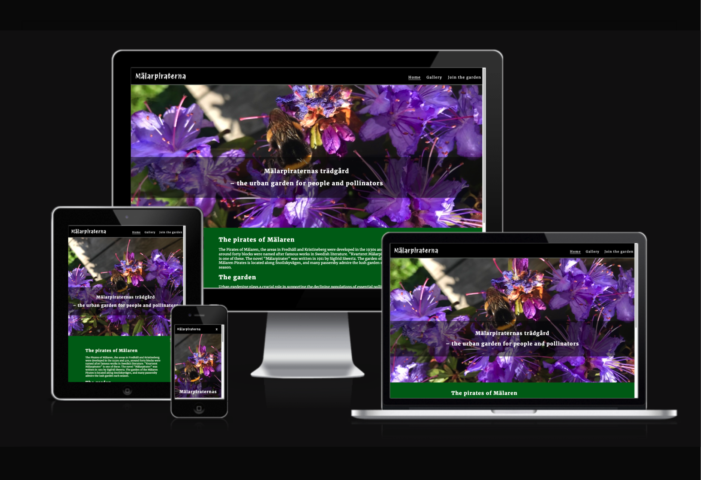

### The Hero image

The hero image on the hompage shows a purple flower and a bee from the garden. This section introduces the user to Mälarpiraterna garden with an eye catching image 
with a matching text overlay to grab their attention to the garden’s purpose and its location. 

- Prominent Hero image on the Home page with text overlay for enhanced readability
- Showcases a captivating view of the garden to engage users

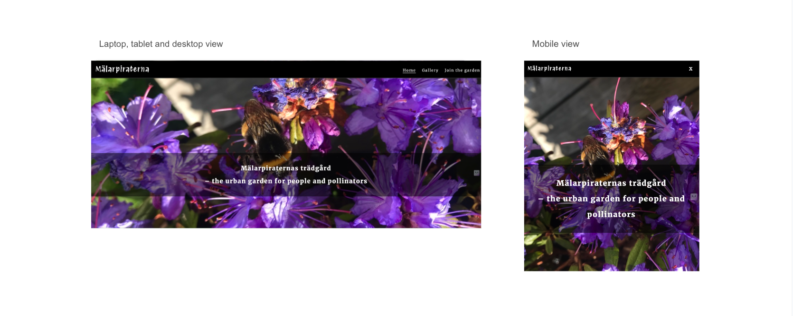

------

### Primary content

The primary content is placed below the Hero section on the home page. The text is placed in a paragraph with responsive width and adjusted margins for good readability on different screen sizes. The font size and the colors of Whitesmoke text on darkgreen background for a good readability and comfortable color palette for the eyes.

- The text provides information of the garden, such as the gardens history, it's purpose and benefits
- At the end a link to the gallery page is provided to easily reach the gallery to view photos of the garden
- The link is underlined to emphasize it is a link

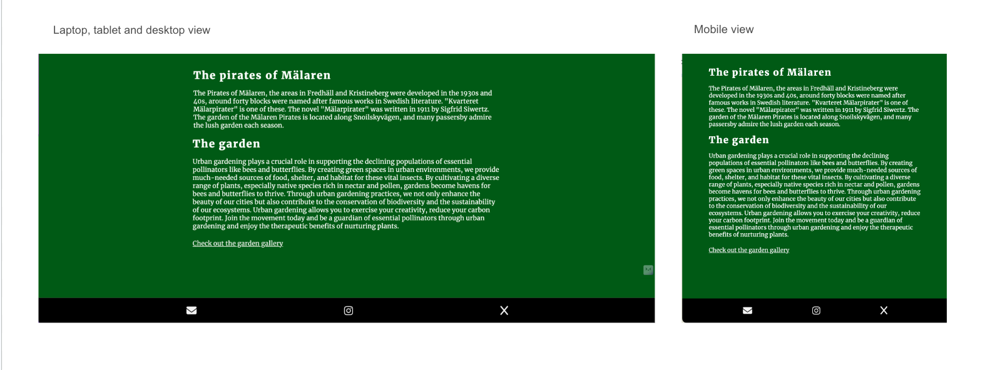

------
## The Gallery

The gallery section is filled with photos from the garden. This section is valuable to the user as they will see an urban garden thriving during the season and encourage the user to consider Mälarpiraternas garden as their form of gardening and join the group

- Features a collection of photos showcasing the garden's beauty and encouraging users to join the gardening community

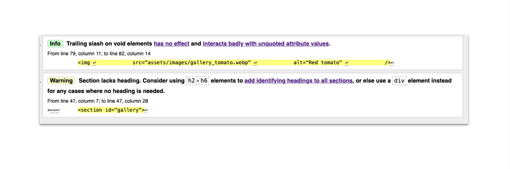

------

## Join the garden

This page will allow the user to sign up for membership in Mälarpiraterna's garden. 

- Enables users to register as members by providing their full name and email address
- The text fields are mandatory and form can not be submitted unfilled.
- The text field for email ensures that the filled text is an email-address 

------

## Future Implementations
Planned features include:
- Farmers calendar for seed planting schedules
- Contact list for seed trading
- Link library for additional resources

------

## Testing

The website has undergone rigorous testing to ensure functionality across different browsers and screen sizes. No errors were found in HTML and CSS validation tests...

(....mention in this section how your project looks and works on different browsers and screen sizes.
You should also mention in this section any interesting bugs or problems you discovered during your testing, even if you haven't addressed them yet.
If this section grows too long, you may want to split it off into a separate file and link to it from here....)

------

### Validator Testing

#### HTML
  - No errors were returned when passing through the official W3C validator

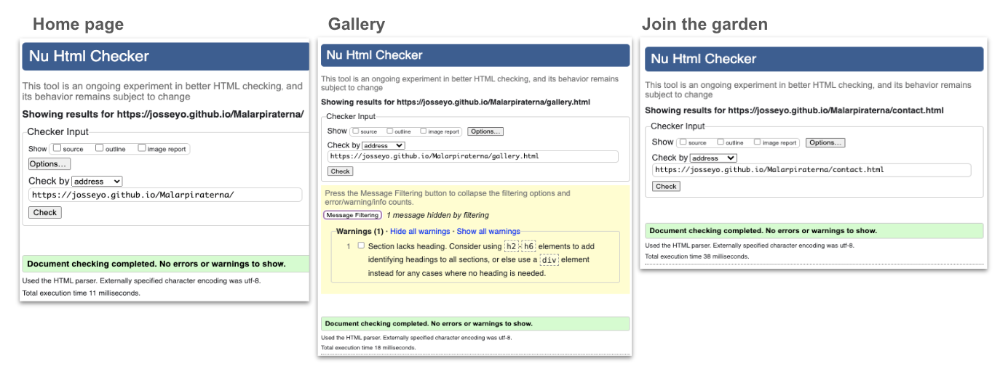
#### CSS
  - No errors were found when passing through the official (Jigsaw) validator

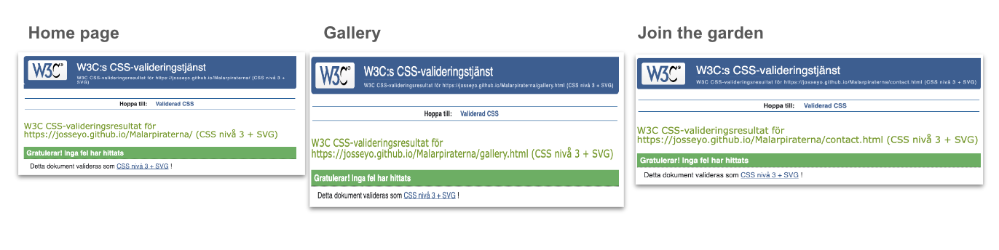

#### Speedtesting overview

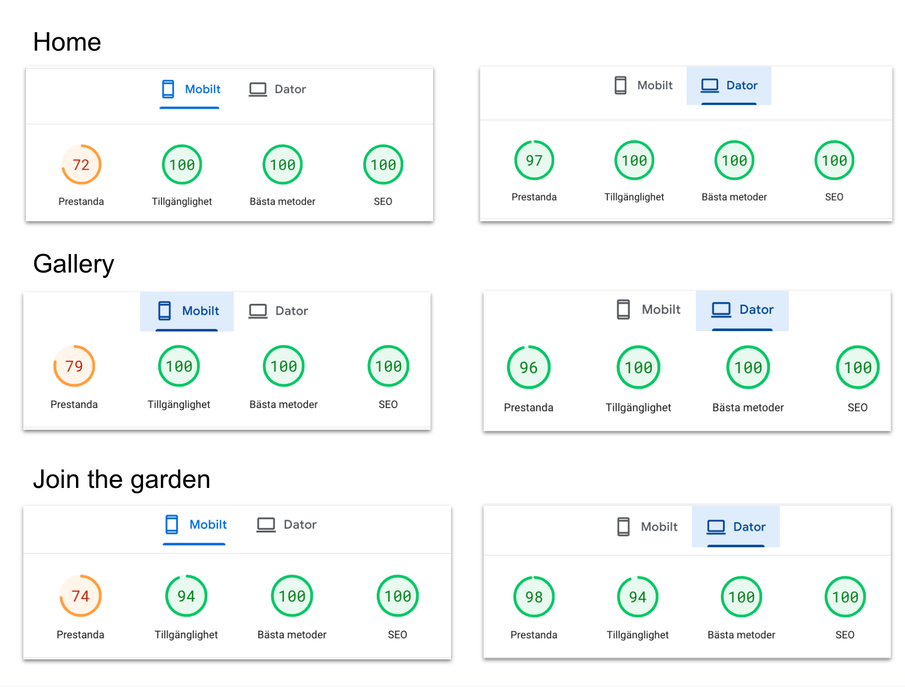

##### Home Speedtesting details

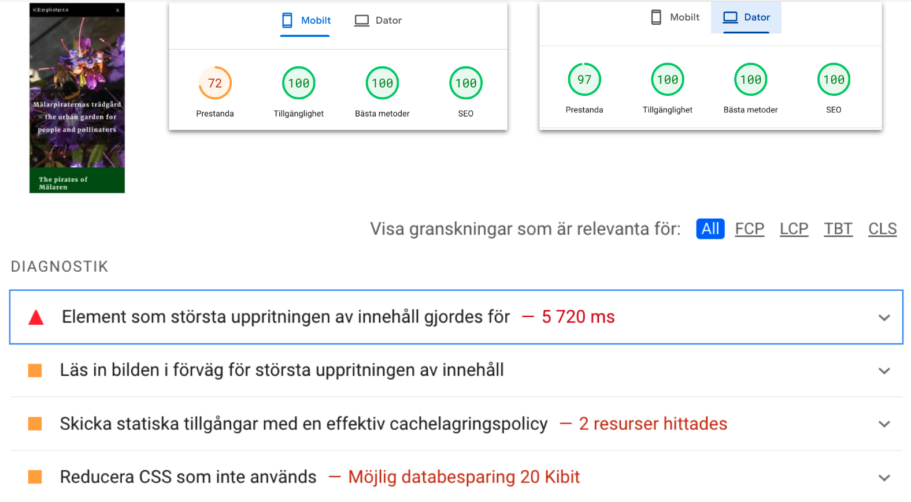

------
    
### Unfixed Bugs
....mention unfixed bugs and why they were not fixed. This section should include shortcomings of the frameworks or technologies used. Although time can be a big variable to consider, paucity of time and difficulty understanding implementation is not a valid reason to leave bugs unfixed....

- Warning: Section lacks heading. Consider using h2-h6 elements to add identifying headings to all sections, or else use a div element instead for any cases where no heading is needed.

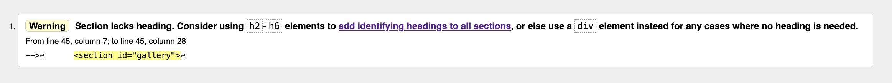

From line 45, column 7; to line 45, column 28

-->↩      <section id="gallery">↩    

------
### Manual testing

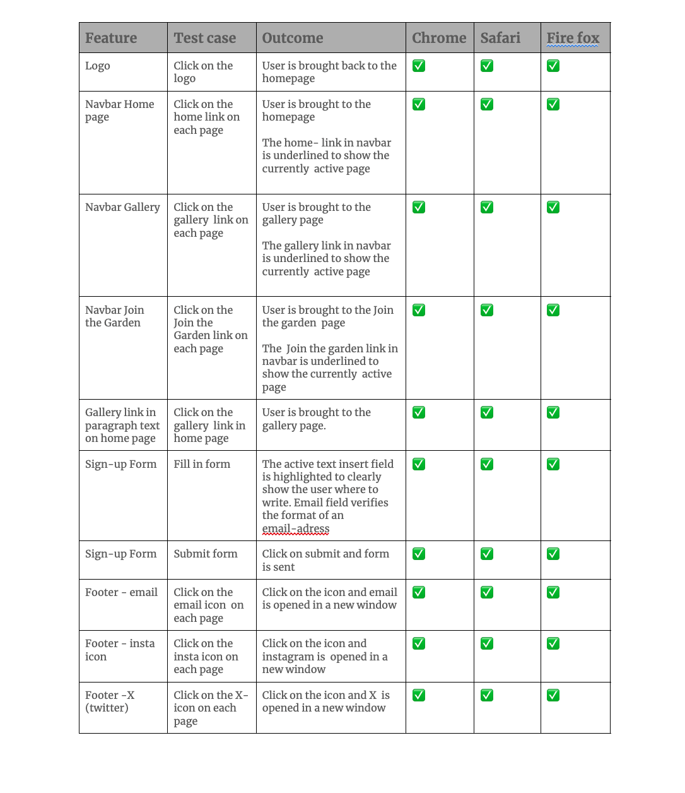

https://docs.google.com/document/d/1GvBAvt2jdHdPX7isx49NbzpCtF8MsiNWt7Qk4x7rd60/edit?usp=sharing

## Deployment

Following process has been followed to deploy the project to GitHub pages
- In the GitHub project repository, go to the Settings tab
- Under Code and Automation, go to pages
- Under Build and deployment, choose to deploy from bransch
- Under branch, select main
- Then select save
- The live website can be found here 
https://josseyo.github.io/Malarpiraterna/

------

## Credits
Special thanks to individuals who contributed to the development of this website:
- Mentor Rory Sheridan for valuable guidance
- Classmate Christina for unwavering support
- Slackmate Sheryl for positive energy and insights on neurodiversity needs
- Chrystyna, our class coordinator, for assistance and resources

------

### Sources of information
This project drew inspiration from various sources including Code Institute's learning materials, online tutorials, .....

------

## Content
- The text for the Home page was taken from SKB.org https://www.skb.org/vara-bostader/innerstaden/fredhall/malarpirater/
- Instructions how to align page content in HTML https://www.youtube.com/watch?v=uHyf748qbI8&t=18s
- The icons in the footer were taken from Font Awesome
- Google fonts: Logo in Protest Revolution, text in Merriweather

------

### Media
- All photos used on the web page are taken by the author
- Tiny jpg has been used to resize the photos to fit the web

------

Thank you for visiting Mälarpiraternas Trädgård! 🌿🌼

## Release History

We continually tweak and adjust this website to give the best user experience. Here is the version history:

**Mars 18 2024:** Update 

**September 1 2021:** Remove 

**June 30 2021:** Combined 

**June 10 2021:** Added

**April 7 2021:** Upgraded the template 

**Anything else….?**

I want to tell you this so that I am being completely transparent about the code....but many changes have taken place and I am aware of that there are changes that has not been commented...

---

