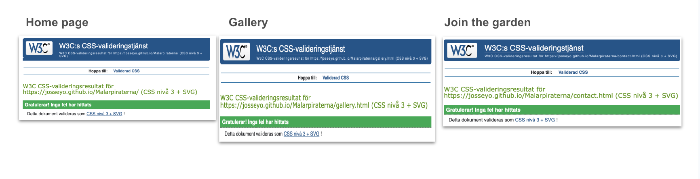

**March 19, 2024**

------
## Mälarpiraternas Trädgård

The garden of the Pirates of Mälaren, "Mälarpiraternas Trädgård", is located by a popular strolling street in Kungsholmen Stockholm. Many curious visitors are stopping by with questions and wishes to join. The answers to these questions can be found on this page. A QR code is placed in the garden to assist in finding the page.

I live next to the garden, and I frequently respond to inquiries from curious passersby. This inspired me to create a website containing essential information and a sign-up form for individuals interested in becoming part of the garden community.

This is my PP1 project: A HTML/CSS frontend web application project, based on user experience design, accessibility and responsiveness.

------

## Visitor’s goal:

The primary aim of this website is to address common questions from curious passersby who wish to know more about the garden and perhaps even join. Visitors can find information on:

- Find information about the garden
- Who is the garden for
- How can you join
  
------

## Site Objectives

Our site aims to:
- Serve as an informative platform about Mälarpiraternas Trädgård
- Inspire urban gardening and foster connections with the garden's community
- Adhere to accessibility standards through features like contrast and easy navigation
- Reflect a pirate theme in the logo and a green gardening ambiance in the font, colors, and shapes
- Ensure ease of exploration and navigation for users

------

## Design

### Colors
The website's color palette intend to harmonize with the site's natural theme and floral imagery. The dark green is employed in the background to provide a solid foundation to complement the vibrant flower photos. Additionally, the use of black and white ensures strong contrast and enhances the readability of the primary content and naviation. Finally, a touch of pink has been reserved for call-to-action and signup button for added emphasis.

### Fonts

- The google font, Protest Revolution, is used in the h1 logo, to give a hand written text style to match the pirate theme. 
- Merriweater is used for body text and headers to match the organic content

### Web Structure & Wireframes

The website consists of three main pages:
1. Home
2. Gallery
3. Contact

#### See details of each page of the website with descriptions in Features below
------

# Features

## Head
- Includes essential elements for Google searchability like Title, Meta description, and Meta keywords

## Header & Footer
Responsive Header and Footer is the first and last section and are visible on each page. All content and services should always be near and clear to make it quick and easy for the user to find and reach what they are looking for. Header and Footer in black and white for optimal contrast and readability. The colors also create consistency and clear separation from the main content and creates a clear line to the surrounding navigation

#### Header 
- Logo designed to match the pirate theme of the garden, placed to the left 
- Navbar with links to Home, Gallery and Join the Garden, placed to the right
- Active Link is underlined to clearly show the user which page they are on

------

#### Image of header with responsive navbar:

------

#### Footer
Email in the footer is valuable to the user as it gives them easy access to our email-contact and external social media, throughout the site to make it easy to connect with Mälarpiraterna in our external cannels

- Evenly spread out in the footer are inks to our external communication channels; instagram, X (Twitter) and e-mail 
- The links will open to a new tab to allow easy navigation for the user

------

#### Image of footer with email and social media links:

------

## The home page

On the home page, you will find essential information about the garden's purpose and its intended audience. From here, you can proceed to the gallery to view a photo collection from the garden by clicking the link at the end of the paragraph or using the navigation bar at the top. Alternatively, you can directly access the 'Join the Garden' section through the link in the navigation bar. At the bottom of the page, you find links to our contact email and social media channels for easy access to our external platforms."

------

### The Hero image

The hero image on the hompage shows a purple flower and a bee from the garden. This section introduces the user to Mälarpiraterna garden with an eye catching image 
with a matching text overlay to grab their attention to the garden’s purpose and its location. 

- Prominent Hero image on the Home page with text overlay for enhanced readability
- Showcases a captivating view of the garden to engage users

------

#### Image of Hero-image and cover text:

------

### Primary content

The primary content is placed below the Hero section on the home page. The text is placed in a paragraph with responsive width and adjusted margins for good readability on different screen sizes. The font size and the colors of Whitesmoke text on darkgreen background for a good readability and comfortable color palette for the eyes.

- The text provides information of the garden, such as the gardens history, it's purpose and benefits
- At the end a link to the gallery page is provided to easily reach the gallery to view photos of the garden
- The link is underlined to emphasize it is a link

------

#### Image of primary text:

------

## The Gallery

The gallery section is filled with photos from the garden. This section is valuable to the user as they will see an urban garden thriving during the season and encourage the user to consider Mälarpiraternas garden as their form of gardening and join the group

- Features a collection of photos showcasing the garden's beauty and encouraging users to join the gardening community

------

#### Images of gallery page:

------

## Join the garden

This page will allow the user to sign up for membership in Mälarpiraterna's garden. 

- Enables users to register as members by providing their full name and email address
- The text fields are mandatory and form can not be submitted unfilled
- The text field for email ensures that the filled text is an email-address 
- The background is darkgreen with a decorative pink flower 
- The color of the Sign-up button is pink which matches the pink flower and creates a good contrast to the green background

------

#### Images of Join The Garden page:

------

## Future Implementations

Planned features for the future include:

- Farmers calendar for seed planting schedules
- Contact list for seed trading
- Link library for additional and valuable resources

------

## Testing

The website has undergone rigorous testing to ensure functionality across different browsers and screen sizes. No errors were found in HTML and CSS validation tests...

(....mention in this section how your project looks and works on different browsers and screen sizes.
You should also mention in this section any interesting bugs or problems you discovered during your testing, even if you haven't addressed them yet.
If this section grows too long, you may want to split it off into a separate file and link to it from here....)

------

### Validator Testing

------

#### HTML
  - No errors were returned when passing through the official W3C validator

------

#### CSS
  - No errors were found when passing through the official (Jigsaw) validator

------

#### Wave report
- Same alert on all three pages. The home link in navigation bar is redundent but I keep it since I think it makes it clearer for the user to see the home link in navbar on each page.

------

#### Speedtesting overview

------
    
### Fixed Errors & Warnings

- Removed trailing slash on void elements
- To fix Section lack of heading, I added a hidden h2 to the Gallery page
- Reduced image-size to enhance the speed 
- Changed image format on photos in gallery to webp

------

### Manual testing

#### Responsiveness 

Responsiveness verified on following screen sizes

Mobile – 375 x 667 px
Tablet - 768 x 1024 px 
Laptop - 1280 x 802 px 
Desktop - 1600 x 992 px

------

### Browsers

Features tested in following browsers:

Chrome - Version 123.0.6312.59 (Officiell version) (x86_64)
Safari - Version 15.6.1 (17613.3.9.1.16)
Firefox - Version 124.0.1 

------

#### Feature test protocol

------

## Deployment
- I have used the cloud development environment Gitpod, to develop the site. 
- I have installed Gitpod Chrome extension so that I can open a workspace in gitpod directly from github. 
- The terminal in Gitpod and the code, git add ., git commit -m "", git pull and git push have been used to synch Gitpod code space and Github repository. Gitpod source control has also been used for the same purpose.
<!--Deployment steps inspired by CI material-->
- The site was deployed to Github pages by following steps;
- In the GitHub project repository, go to Settings
- Under Code and Automation, go to pages
- Under Build and deployment, choose to deploy from bransch
- Under branch, select main and root
- Then select save
- The live website can be found here 
https://josseyo.github.io/Malarpiraterna/

------

## Credits

Special thanks to the people who contributed to the development of this website:
- Mentor Rory Sheridan for valuable guidance
- Classmate Christina for unwavering support
- Slackmate Sheryl for positive energy and insights on neurodiversity needs
- Kristyna, our class coordinator, for assistance and resources
- Swedish community slack group for prompt responses when needed

------

### Sources of tools and information

- This project drew inspiration from Code Institute's learning materials
- Instructions how to align page content in HTML https://www.youtube.com/watch?v=uHyf748qbI8&t=18s
- html tutorials, https://www.w3schools.com/html/default.asp 
- css tutorials, https://www.w3schools.com/css/default.asp
- WebP converter, https://tiny-img.com/webp/
- Photo editor, https://overbits.herokuapp.com/photoeditor
- Am I responsive? https://ui.dev/amiresponsive?url
- HTML checker,The W3C Markup Validation, https://validator.w3.org/
- CSS checker, https://jigsaw.w3.org/css-validator/
- PageSpeed Insights, https://pagespeed.web.dev/
- Accessibility validator, https://wave.webaim.org/
 
------

## Content

- The text for the Home page was taken from SKB.org https://www.skb.org/vara-bostader/innerstaden/fredhall/malarpirater/
- Chatgpt has been used to create the paragrap text about the garden on the home page
- The icons in the footer were taken from Font Awesome
- Google fonts: Logo in Protest Revolution, body text in Merriweather

------

### Media
- All photos used on the web page are taken by the author

------

## Mentions

It has been a learning journey, and I have improved along the way; therefore, not all commits are perfectly commented. 

------

Thank you for visiting Mälarpiraternas Trädgård! 🌿🌼

---

